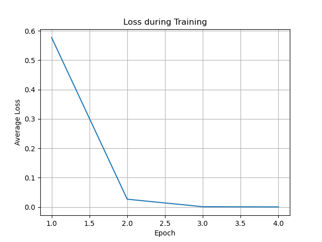

# My-Decoding-Model
This is a simple deep learning model for solving binary vectors. 

This repository implements a deep learning-based decoding model for **group codes**, a special class of error-correcting codes with algebraic structures. The work is inspired by the theoretical framework of group codes and aims to bridge coding theory with deep learning for efficient decoding. The model demonstrates promising performance in recovering encoding matrices and generalizing to noisy data.

For more detailed information and the specific work I have done, please refer to the paper **Deep Lreaning Decoding Model Based on Group Codes**.

---

# ✨🎯🎯🎯✨I need help
Currently, it can handle the binary decoding from a 15 - dimensional space to a 25 - dimensional one. However, when the dimension is increased to 30, the model performance deteriorates significantly. There are two main issues contributing to this problem. Firstly, generating 2**30 samples once is extremely difficult. Secondly, the current network fails to approximate the encoding matrix G.

---

## 📖 Research Background
Group codes are widely used in communication systems due to their error-correcting capabilities, but traditional decoding methods are computationally intensive. This project proposes a novel approach:
- **Key Insight**: The encoding function of group codes resembles the forward propagation of neural networks.
- **Objective**: Train a neural network to approximate the encoding matrix G , enabling efficient decoding even with noisy inputs.

---

## 🛠 Methodology & Model Architecture
### Key Components
1. **Data Generation** (`BinaryDataset`):
   - Generates binary input-output pairs $(a, x)$ where $x = (a \cdot v) \mod 2$.
   - Supports large-scale training with customizable dimensions (e.g., 20-dimensional inputs).

2. **Training & Evaluation**:
   - **Optimizer**: Adam with learning rate scheduling.
   - **Stopping Criteria**: Early stopping if loss falls below $10^{-3}$.
   - **Testing**: Evaluates accuracy using threshold-based predictions (e.g., $>0.995$ for 1, $<0.005$ for 0).

### Improvements from Theory to Practice
- Replaced discontinuous $ mod 2 $ activation with **Sigmoid** for gradient stability.
- Simplified loss function from exponential terms to **MSE** for faster convergence.
- Increased network depth (2 hidden layers) and input dimensions (up to 20D) to enhance model capacity.

---

## 📊 Results
- **Training Loss**: Achieved near-zero loss 0.0001 within 3 epochs, indicating strong convergence.
- **Test Accuracy**: 100% accuracy on synthetic data with noiseless inputs.



---

## 🚀 How to Use
### Installation
```bash
git clone https://github.com/hy-0003/My-Decoding-Model.git
See Appendix for Conda environment details
